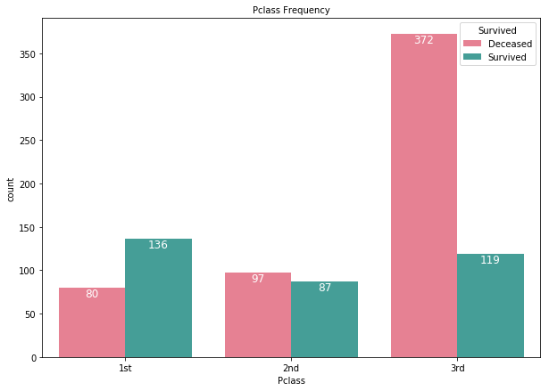
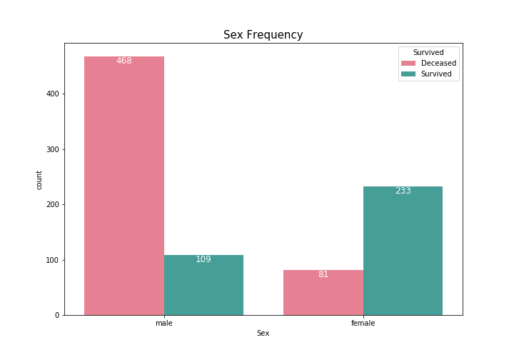
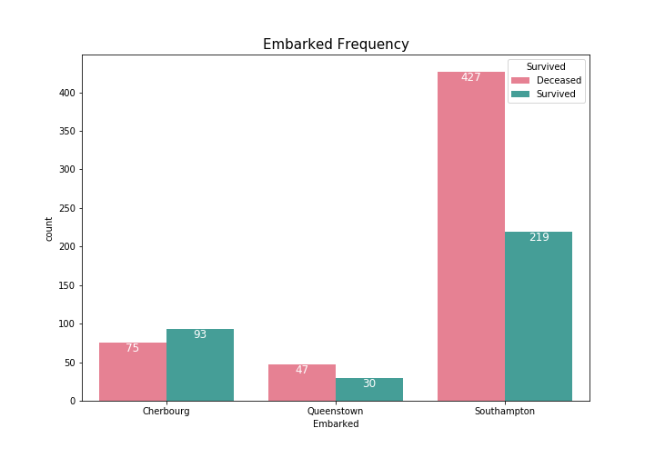
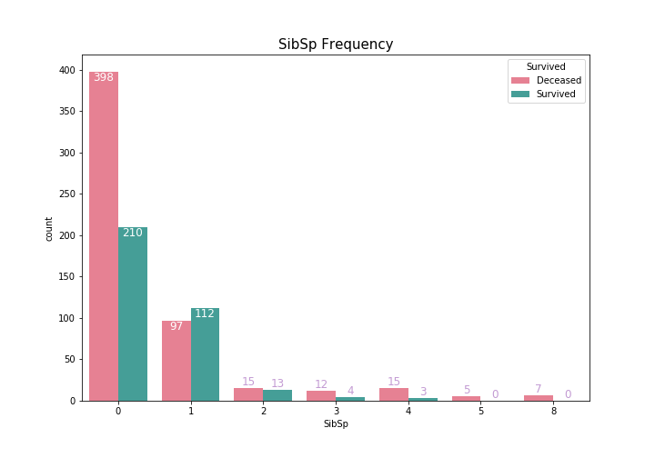
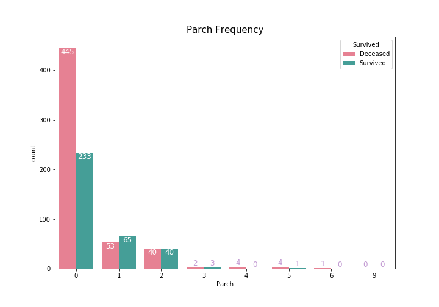
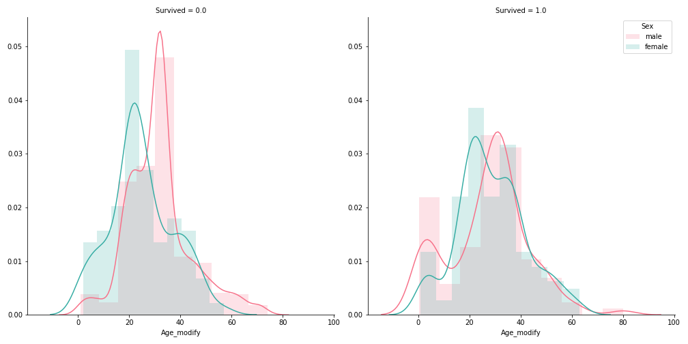
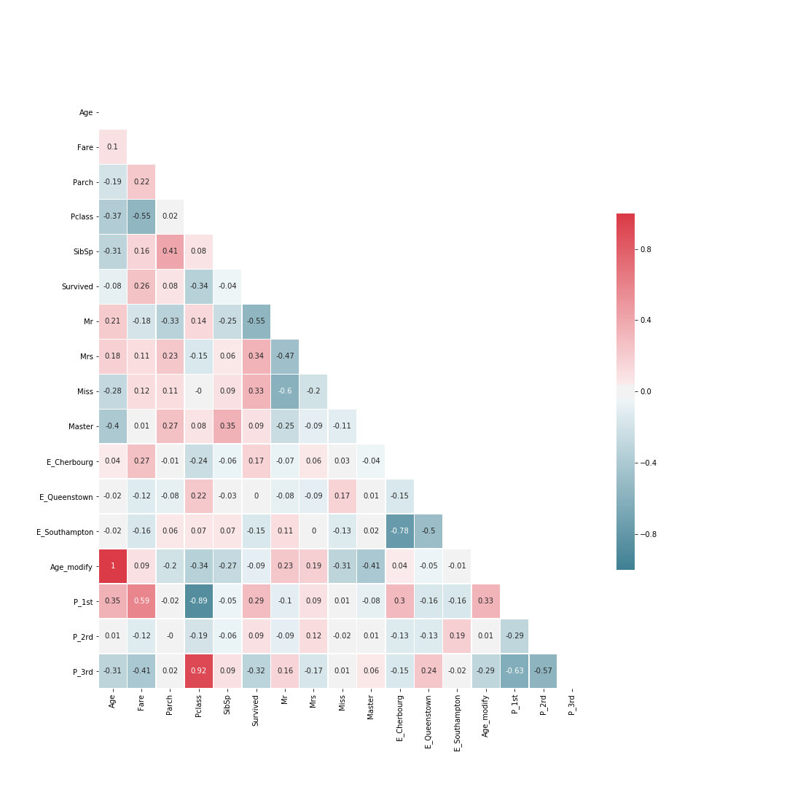

##### kaggle 'Titanic : Machine Learning from Disaster'

# 1. EDA and Preprocessing
[source code](01_EDA.py)

<br>

---

## Explor the data

#### Data shape

| Data | Col | Row |
|:----:|:---:|:---:|
| Train | 12 | 891 |
| Test | 11 | 418 |

<br>

#### Data columns

| Data | Columns |
|:----:|---------|
| Train | Survived, Pclass, Name, Sex, Age, SibSp, Parch, Ticket, Fare, Cabin, Embarked |
| Test | Pclass, Name, Sex, Age, SibSp, Parch, Ticket, Fare, Cabin, Embarked |

<br>

#### Data Type

* Train

| Feature | Type |
|---------|------|
| Survived | int64 |
| Pclass | int64|
| Name |  object |
| Sex | object |
| Age | float64 |
| SibSp | int64 |
| Parch | int64 |
| Ticket | object |
| Fare | float64 |
| Cabin | object |
| Embarked |  object |

<br>

* Test

| Feature | Type |
|---------|------|
| Pclass | int64|
| Name |  object |
| Sex | object |
| Age | float64 |
| SibSp | int64 |
| Parch | int64 |
| Ticket | object |
| Fare | float64 |
| Cabin | object |
| Embarked |  object |

<br>

## Check missing values

* Train

| Feature | Count |
|---------|------:|
| Age | 177 |
| Cabin | 687 |
| Embarked | 2 |

<br>

* Test

| Feature | Count |
|---------|------:|
| Age | 86 |
| Fare | 1 |
| Cabin | 327 |

<br>

## Check level counts

#### Pclass

* Train

| Level | Count |
|-------|------:|
| 1st | 216 |
| 2nd | 184 |
| 3rd | 491 |

<br>

* Test

| Level | Count |
|-------|------:|
| 1st | 107 |
| 2nd | 93 |
| 3rd | 218 |

<br>

#### Embarked

* Train

| Level | Count |
|-------|------:|
| S | 644 |
| C | 168 |
| Q | 77 |

<br>

* Test

| Level | Count |
|-------|------:|
| S |  270 |
| C | 46 |
| Q | 102 |

<br>

#### SibSp

* Train

| Level | Count |
|-------|-------|
| 0 | 608 |
| 1 | 209 |
| 2 | 28 |
| 3 | 16 |
| 4 | 18 |
| 5 | 5 |
| 8 | 7 |

<br>

* Test

| Level | Count |
|-------|-------|
| 0 | 283 |
| 1 | 110 |
| 2 | 14 |
| 3 | 4 |
| 4 | 4 |
| 5 | 1 |
| 8 | 2 |

<br>

#### Parch

* Train

| Level | Count |
|-------|-------|
| 0 | 678 |
| 1 | 118 |
| 2 | 80 |
| 3 | 5 |
| 4 | 4 |
| 5 | 5 |
| 6 | 1 |

<br>

* Test

| Level | Count |
|-------|-------|
| 0 | 324 |
| 1 | 52 |
| 2 | 33 |
| 3 | 3 |
| 4 | 2 |
| 5 | 1 |
| 6 | 1 |
| 9 | 2 |

<br>

#### Survived

| Level | Count |
|-------|-------|
| Deceased | 549 |
| Survived | 342 |

<br>

---

## Merge train data and test data

```python
train['dataset'] = 'train set'
test['dataset'] = 'test set'
merged = pd.concat([train, test])
```

* Merged Data Shape : (1309, 12)

---

## Change the string value to an integer value

#### Sex

```python
merged.loc[merged['Sex'] == 'male', 'Sex'] = 0
merged.loc[merged['Sex'] == 'female', 'Sex'] = 1
```

| String | Integer |
|--------|---------|
| male | 0 |
| female | 1 |

<br>

#### Embarked

```python
merged.loc[merged['Embarked'] == 'C', 'Embarked'] = 0
merged.loc[merged['Embarked'] == 'Q', 'Embarked'] = 1
merged.loc[merged['Embarked'] == 'S', 'Embarked'] = 2
```

| String | Integer |
|--------|---------|
| C | 0 |
| Q | 1 |
| S | 2 |

<br>

---

## Draw bar graphs

* #### Pclass bar graph of train data and test data


<br>

* #### Pclass bar graph of train data per Deceased or Survived



<br>

#### Sex

```python
count_bar(merged, 'Sex', 'dataset')
plt.xticks([0,1], ('male', 'female'))
plt.savefig('graph/bar_Sex.png')
plt.show()
```


<br>

```python
count_bar(merged, 'Sex', 'Survived')
plt.xticks([0,1], ('male', 'female'))
plt.savefig('graph/bar_Sex_Survived.png')
plt.show()

```



<br>

#### Embarked

```python
count_bar(merged, 'Embarked', 'dataset')
plt.xticks([0,1,2], ('Cherbourg', 'Queenstown', 'Southampton'))
plt.savefig('graph/bar_Embarked.png')
plt.show()
```


<br>

```python
count_bar(merged, 'Embarked', 'Survived')
plt.xticks([0,1,2], ('Cherbourg', 'Queenstown', 'Southampton'))
plt.savefig('graph/bar_Embarked_Survived.png')
plt.show()
```



<br>

---

## Draws bar graphs

#### SibSp

```python
count_bar(merged, 'SibSp', 'dataset')
plt.savefig('graph/bar_SibSp.png')
plt.show()
```


<br>

```python
count_bar(merged, 'SibSp', 'Survived')
plt.savefig('graph/bar_SibSp_Survived.png')
plt.show()
```



<br>

#### Parch

```python
count_bar(merged, 'Parch', 'dataset')
plt.savefig('graph/bar_Parch.png')
plt.show()
```


<br>

```python
count_bar(merged, 'Parch', 'Survived')
plt.savefig('graph/bar_Parch_Survived.png')
plt.show()
```



<br>

## Makes a feature : family

```python
merged['family'] = merged['SibSp'] + merged['Parch'] + 1
```

<br>

```python
count_bar(merged, 'family', 'dataset')
plt.savefig('graph/bar_family.png')
plt.show()
```


<br>

```python
count_bar(merged, 'family', 'Survived')
plt.savefig('graph/bar_family_Survived.png')
plt.show()
```


<br>

## Split family size

```python
merged['family_class'] = np.nan
merged.loc[merged['family'] == 1, 'family_class'] = 1
merged.loc[merged['family'] > 1, 'family_class'] = 2
merged.loc[merged['family'] > 4, 'family_class'] = 3
```

<br>

```python
count_bar(merged, 'family_class', 'dataset')
plt.savefig('graph/bar_family_class.png')
plt.show()
```


<br>

```python
count_bar(merged, 'family_class', 'Survived')
plt.savefig('graph/bar_family_class_Survived.png')
plt.show()
```


<br>

---

## Draw bar graphs per Survived

```python
def countplot(x, hue, **kwargs):
    sns.countplot(x=x, hue=hue, palette='husl')

def bar(data, x, hue, col):
    g =  sns.FacetGrid(data, col=col, size=7)
    g = g.map(countplot, x, hue)
```

<br>

```python
bar(merged, 'Pclass', 'Sex', 'Survived')
plt.xticks([0,1,2], ('1st', '2nd', '3rd'))
plt.legend(('male','female')).set_title('Sex')
plt.savefig('graph/bar_Pclass_Sex_Survived.png')
plt.show()
```


<br>

```python
bar(merged, 'Embarked', 'Sex', 'Survived')
plt.xticks([0,1,2], ('Cherbourg', 'Queenstown', 'Southampton'))
plt.legend(('male','female')).set_title('Sex')
plt.savefig('graph/bar_Embarked_Sex_Survived.png')
plt.show()
```


<br>

```python
bar(merged, 'family_class', 'Sex', 'Survived')
plt.legend(('male', 'female')).set_title('Sex')
plt.savefig('graph/bar_family_class_Sex_Survived.png')
plt.show()
```


<br>

---

## Extract title name

```python
def title_name(name):
    n = re.findall(', .{1,15}\.', name)
    return ' '.join(n)[2:]

merged['title_name'] = np.nan
merged['title_name'] = merged['Name'].apply(lambda x: title_name(x))
```

<br>

## Draw title name bar graphs

```python
def Name_bar(data, hue):
    plt.figure(figsize=(15,7))
    ax = sns.countplot(x='title_name', hue=hue, data=data, palette='husl')                            
    plt.xlabel('')
    plt.xticks(rotation=30)
    plt.legend(loc='upper right')
    plt.title('Title Name frequency', fontsize=15)

    for p in ax.patches:
        a = p.get_height()

        if np.isnan(a):
            a = 0

        ax.text(p.get_x() + p.get_width()/2.,
                a, '%d' % int(a),
                fontsize=12, ha='center', va='bottom', color='#C39BD3')
```

<br>

```python
Name_bar(merged, 'dataset')
plt.savefig('graph/bar_Name.png')
plt.show()
```


<br>

```python
Name_bar(merged, 'Survived')
plt.savefig('graph/bar_Name_Survived.png')
plt.show()
```


<br>

---

### Change the title name to integer

```python
def Name_to_number(data):
    data['Mr'] = 0
    data.loc[data['title_name'] == 'Mr.', 'Mr'] = 1

    data['Mrs'] = 0
    data.loc[data['title_name'] == 'Mrs.', 'Mrs'] = 1

    data['Miss'] = 0
    data.loc[data['title_name'] == 'Miss.', 'Miss'] = 1

    data['Master'] = 0
    data.loc[data['title_name'] == 'Master.', 'Master'] = 1

    return data

merged = Name_to_number(merged)
```

<br>

### Fill the missing value of Embarked

```python
merged.loc[merged['Embarked'].isnull(), 'Embarked'] = 2
```

<br>

### Do one-hot encoding

```python
temp = pd.get_dummies(merged.Pclass)
temp.columns = ['P_1st', 'P_2rd', 'P_3rd']
merged = pd.concat([merged, temp], axis=1)
```

<br>

```python
temp = pd.get_dummies(merged.Embarked)
temp.columns = ['E_Cherbourg', 'E_Queenstown', 'E_Southampton']
merged = pd.concat([merged, temp], axis=1)
```

<br>

---

### Draw boxplots about Age

```python
def box(data, x, y, hue=None):
    plt.figure(figsize=(10,7))
    sns.boxplot(x=x, y=y, hue=hue, data=data, palette='husl')
```

<br>

```python
box(merged, 'dataset', 'Age')
plt.savefig('graph/box_Age.png')
plt.show()
```


<br>

```python
box(merged, 'Sex', 'Age')
plt.xticks((0,1),('male','female'))
plt.savefig('graph/box_Age_Sex.png')
plt.show()
```


<br>

```python
box(merged, 'Sex', 'Age', 'Mr')
plt.xticks((0,1),('male','female'))
plt.savefig('graph/box_Age_Sex_Mr.png')
plt.show()
```


<br>

```python
box(merged, 'Sex', 'Age', 'Mrs')
plt.xticks((0,1),('male','female'))
plt.savefig('graph/box_Age_Sex_Mrs.png')
plt.show()
```


<br>

```python
box(merged, 'Sex', 'Age', 'Miss')
plt.xticks((0,1),('male','female'))
plt.savefig('graph/box_Age_Sex_Miss.png')
plt.show()
```


<br>

```python
box(merged, 'Sex', 'Age', 'Master')
plt.xticks((0,1),('male','female'))
plt.savefig('graph/box_Age_Sex_Master.png')
plt.show()
```


<br>

---

### Fill the missing value of Age

```python
temp = merged.groupby(['Sex', 'Mr', 'Mrs', 'Miss', 'Master'])['Age'].mean()
print(temp)
```
| Sex | Mr | Mrs | Miss | Master | Age |
|-----|-----|-----|-----|-----|-------:|
| 0 | 0 | 0 | 0 | 0 | 45.666667 |
| 0 | 0 | 0 | 0 | 1 | 5.482642 |
| 0 | 1 | 0 | 0 | 0 | 32.252151 |
| 1 | 0 | 0 | 0 | 0 | 33.625000 |
| 1 | 0 | 0 | 1 | 0 | 21.774238 |
| 1 | 0 | 1 | 0 | 0 | 36.994118 |

<br>

```python
temp = merged.groupby(['Sex', 'Mr', 'Mrs', 'Miss', 'Master'])['Age'].transform('mean')
merged['Age_modify'] = merged['Age'].fillna(temp)
```

<br>

---

### Draw histograms and boxplot about Age

```python
def hist(data, a, hue, col=None):
    g =  sns.FacetGrid(data, hue=hue, col=col, size=7, palette='husl')
    g = g.map(sns.distplot, a, hist_kws={'alpha':0.2})
```

<br>

```python
hist(merged, 'Age', 'dataset')
plt.legend(['train','test']).set_title('dataset')
plt.savefig('graph/hist_Age.png')
plt.show()
```


<br>

```python
hist(merged, 'Age_modify', 'dataset')
plt.legend(['train','test']).set_title('dataset')
plt.savefig('graph/hist_Age_modify.png')
plt.show()
```


<br>

```python
hist(merged, 'Age_modify', 'Survived')
plt.legend().set_title('Survived')
plt.savefig('graph/hist_Age_modify_Survived.png')
plt.show()
```


<br>

```python
hist(merged, 'Age_modify', 'Sex', 'Survived')
plt.legend(['male','female']).set_title('Sex')
plt.savefig('graph/hist_Age_modify_Sex.png')
plt.show()
```



<br>

```python
box(merged, 'Survived', 'Age_modify')
plt.savefig('graph/box_Age_Survived.png')
plt.show()
```


```python
box(merged, 'Sex', 'Age_modify', 'Survived')
plt.legend(['male','female']).set_title('Sex')
plt.savefig('graph/box_Age__modify_Sex_Survived.png')
plt.show()
```


<br>

### Draw boxplots and histograms about Fare

```python
box(merged, 'dataset', 'Fare')
plt.savefig('graph/box_Fare.png')
plt.show()
```


<br>

```python
box(merged, 'Survived', 'Fare')
plt.savefig('graph/box_Fare_Survived.png')
plt.show()

```


<br>

```python
box(merged, 'Pclass', 'Fare')
plt.xticks((0,1,2), ('1st', '2nd', '3rd'))
plt.savefig('graph/box_Fare_Pclass.png')
plt.show()
```


<br>

```python
hist(merged, 'Fare', 'dataset')
plt.legend(['train','test']).set_title('dataset')
plt.savefig('graph/hist_Fare.png')
plt.show()
```


<br>

---

### Save datasets

```python
train = merged.iloc[:891]
train.to_csv('train_modify.csv')

test = merged.iloc[891:]
test.to_csv('test_modify.csv')

merged.to_csv('merged_modify.csv')
```

<br>

### Check the correlation

```python
corr = train.corr(method='pearson')
corr = corr.round(2)
mask = np.zeros_like(corr, dtype=np.bool)
mask[np.triu_indices_from(mask)] = True
cmap = sns.diverging_palette(220, 10, as_cmap=True)

plt.figure(figsize=(15,15))
sns.heatmap(corr, vmin=-1, vmax=1,
            mask=mask, cmap=cmap, annot=True, linewidth=.5, cbar_kws={'shrink':.6})
plt.savefig('graph/heatmap.png')
plt.show()
```


