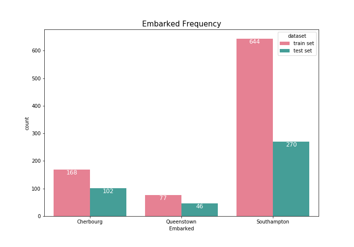
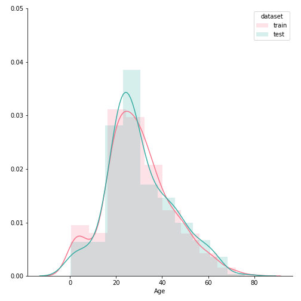
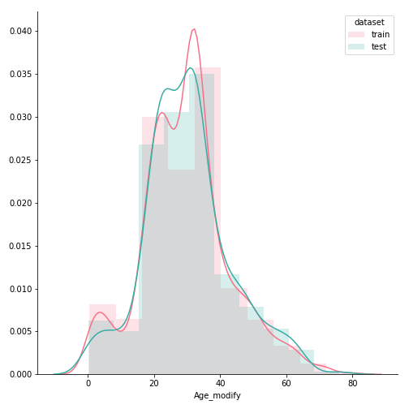

##### kaggle 'Titanic : Machine Learning from Disaster'

# 1. EDA and Preprocessing

### Import ibrary and load data


```python
import pandas as pd
import numpy as np
import re

import matplotlib.pyplot as plt
import seaborn as sns


train = pd.read_csv('train.csv', index_col=['PassengerId'])
test = pd.read_csv('test.csv', index_col=['PassengerId'])
```

<br>

### Explor the data

* train shape : (891, 12)
* test shape : (418, 11)

<br>

* train columns : Survived, Pclass, Name, Sex, Age, SibSp, Parch, Ticket, Fare, Cabin, Embarked
* test columns : Pclass, Name, Sex, Age, SibSp, Parch, Ticket, Fare, Cabin, Embarked

<br>

* train info : <br>
Survived    891 non-null int64
Pclass      891 non-null int64
Name        891 non-null object
Sex         891 non-null object
Age         714 non-null float64
SibSp       891 non-null int64
Parch       891 non-null int64
Ticket      891 non-null object
Fare        891 non-null float64
Cabin       204 non-null object
Embarked    889 non-null object
* test info : <br>
Pclass      418 non-null int64
Name        418 non-null object
Sex         418 non-null object
Age         332 non-null float64
SibSp       418 non-null int64
Parch       418 non-null int64
Ticket      418 non-null object
Fare        417 non-null float64
Cabin       91 non-null object
Embarked    418 non-null object

<br>

* train missing values : <br>
Age : 177
Cabin : 687
Embarked : 2
* test missing values : <br>
Age : 86
Fare : 1
Cabin : 327

<br>

* train data Pclass :
1 : 216
2: 184
3 : 491
* test data Pclass :
1 : 107
2 : 93
3 : 218

<br>

* train data Embarked :
S : 644
C : 168
Q : 77
* test data Embarked :
S : 270
Q : 46
X : 102

<br>

* train data SibSp :
0 : 608
1 : 209
2 : 28
3 : 16
4 : 18
5 : 5
8 : 7
* test data SibSp :
0 : 283
1 : 110
2 : 14
3 : 4
4 : 4
5 : 1
8 : 2

<br>

* train data Parch :
0 : 678
1 : 118
2 : 80
3 : 5
4 : 4
5 : 5
6 : 1
* test data Parch :
0 : 324
1 : 52
2 : 33
3 : 3
4 : 2
5 : 1
6 : 1
9 : 2

<br>

* train data Survived :
0 : 549
1 : 342

---

### Merge train data and test data

```python
train['dataset'] = 'train set'
test['dataset'] = 'test set'

merged = pd.concat([train, test])
```

* merged data shape : (1309, 12)
* merged data columns : Age, Cabin, Embarked, Fare, Name, Ticket, Parch, Pclass, Sex, SibSp, Survived, dataset

<br>

### Change feature to integer

```python
def to_number(data):
    data.loc[data['Sex'] == 'male', 'Sex'] = 0
    data.loc[data['Sex'] == 'female', 'Sex'] = 1

    print(data['Sex'].head())

    data.loc[data['Embarked'] == 'C', 'Embarked'] = 0
    data.loc[data['Embarked'] == 'Q', 'Embarked'] = 1
    data.loc[data['Embarked'] == 'S', 'Embarked'] = 2

    print(data['Embarked'].head())

    return data

merged = to_number(merged)
```

<br>

### Extract the title Name

```python
def title_name(name):
    n = re.findall(', .{1,15}\.', name)
    return ' '.join(n)[2:]

merged['title_name'] = np.nan
merged['title_name'] = merged['Name'].apply(lambda x: title_name(x))

del merged['Name']
```

<br>

---

### Draw bar graphs

```python
def count_bar(data, x, hue):
    plt.figure(figsize=(10,7))
    ax = sns.countplot(x=x, hue=hue, data=data, palette='husl')
    plt.title(x + ' Frequency', fontsize=15)
    plt.legend(loc='upper right').set_title(hue)

    for p in ax.patches:
        a = p.get_height()
        va = 'top'
        color = 'white'

        if np.isnan(a):
            a = 0

        if a < 30:
            va = 'bottom'
            color = '#C39BD3'

        ax.text(p.get_x() + p.get_width()/2., a, '%d' % int(a),
                fontsize=12, ha='center', va=va, color=color)
```

<br>

```python
count_bar(merged, 'Pclass', 'dataset')
plt.xticks([0,1,2], ('1st', '2nd', '3rd'))
plt.savefig('graph/bar_Pclass.png')
plt.show()
```


<br>

```python
count_bar(merged, 'Pclass', 'Survived')
plt.xticks([0,1,2], ('1st', '2nd', '3rd'))
plt.savefig('graph/bar_Pclass_Survivd.png')
plt.show()
```


<br>

```python
count_bar(merged, 'Sex', 'dataset')
plt.xticks([0,1], ('male', 'female'))
plt.savefig('graph/bar_Sex.png')
plt.show()
```


<br>

```python
count_bar(merged, 'Sex', 'Survived')
plt.xticks([0,1], ('male', 'female'))
plt.savefig('graph/bar_Sex_Survived.png')
plt.show()

```


<br>

```python
count_bar(merged, 'Embarked', 'dataset')
plt.xticks([0,1,2], ('Cherbourg', 'Queenstown', 'Southampton'))
plt.savefig('graph/bar_Embarked.png')
plt.show()
```



<br>

```python
count_bar(merged, 'Embarked', 'Survived')
plt.xticks([0,1,2], ('Cherbourg', 'Queenstown', 'Southampton'))
plt.savefig('graph/bar_Embarked_Survived.png')
plt.show()
```


<br>

```python
count_bar(merged, 'SibSp', 'dataset')
plt.savefig('graph/bar_SibSp.png')
plt.show()
```


<br>

```python
count_bar(merged, 'SibSp', 'Survived')
plt.savefig('graph/bar_SibSp_Survived.png')
plt.show()
```


<br>

```python
count_bar(merged, 'Parch', 'dataset')
plt.savefig('graph/bar_Parch.png')
plt.show()
```


<br>

```python
count_bar(merged, 'Parch', 'Survived')
plt.savefig('graph/bar_Parch_Survived.png')
plt.show()
```


<br>

```python
def countplot(x, hue, **kwargs):
    sns.countplot(x=x, hue=hue, palette='husl')

def bar(data, x, hue, col):
    g =  sns.FacetGrid(data, col=col, size=7)
    g = g.map(countplot, x, hue)
```

<br>

```python
bar(merged, 'Pclass', 'Sex', 'Survived')
plt.xticks([0,1,2], ('1st', '2nd', '3rd'))
plt.legend(('male','female')).set_title('Sex')
plt.savefig('graph/bar_Pclass_Sex_Survived.png')
plt.show()
```


<br>

```python
bar(merged, 'Embarked', 'Sex', 'Survived')
plt.xticks([0,1,2], ('Cherbourg', 'Queenstown', 'Southampton'))
plt.legend(('male','female')).set_title('Sex')
plt.savefig('graph/bar_Embarked_Sex_Survived.png')
plt.show()
```


<br>

```python
bar(merged, 'Embarked', 'Pclass', 'Survived')
plt.xticks([0,1,2], ('Cherbourg', 'Queenstown', 'Southampton'))
plt.legend(('1st', '2nd', '3rd')).set_title('Pclass')
plt.savefig('graph/bar_Embarked_Pclass_Survived.png')
plt.show()
```


<br>

```python
def Name_bar(data, hue):
    plt.figure(figsize=(15,7))
    ax = sns.countplot(x='title_name', hue=hue, data=data, palette='husl')                            
    plt.xlabel('')
    plt.xticks(rotation=30)
    plt.legend(loc='upper right')
    plt.title('Title Name frequency', fontsize=15)

    for p in ax.patches:
        a = p.get_height()

        if np.isnan(a):
            a = 0

        ax.text(p.get_x() + p.get_width()/2.,
                a, '%d' % int(a),
                fontsize=12, ha='center', va='bottom', color='#C39BD3')
```

<br>

```python
Name_bar(merged, 'dataset')
plt.savefig('graph/bar_Name.png')
plt.show()
```


<br>

```python
Name_bar(merged, 'Survived')
plt.savefig('graph/bar_Name_Survived.png')
plt.show()
```


<br>

---

### Change the title name to integer

```python
def Name_to_number(data):
    data['Mr'] = 0
    data.loc[data['title_name'] == 'Mr.', 'Mr'] = 1

    data['Mrs'] = 0
    data.loc[data['title_name'] == 'Mrs.', 'Mrs'] = 1

    data['Miss'] = 0
    data.loc[data['title_name'] == 'Miss.', 'Miss'] = 1

    data['Master'] = 0
    data.loc[data['title_name'] == 'Master.', 'Master'] = 1

    return data

merged = Name_to_number(merged)
```

<br>

### Fill the missing value of Embarked

```python
merged.loc[merged['Embarked'].isnull(), 'Embarked'] = 2
```

<br>

### Do one-hot encoding

```python
temp = pd.get_dummies(merged.Embarked)
temp.columns = ['E_Cherbourg', 'E_Queenstown', 'E_Southampton']
merged = pd.concat([merged, temp], axis=1)
```

<br>

---

### Draw boxplots about Age

```python
def box(data, x, y, hue=None):
    plt.figure(figsize=(10,7))
    sns.boxplot(x=x, y=y, hue=hue, data=data, palette='husl')
```

<br>

```python
box(merged, 'dataset', 'Age')
plt.savefig('graph/box_Age.png')
plt.show()
```


<br>

```python
box(merged, 'Sex', 'Age')
plt.xticks((0,1),('male','female'))
plt.savefig('graph/box_Age_Sex.png')
plt.show()
```


<br>

```python
box(merged, 'Sex', 'Age', 'Mr')
plt.xticks((0,1),('male','female'))
plt.savefig('graph/box_Age_Sex_Mr.png')
plt.show()
```


<br>

```python
box(merged, 'Sex', 'Age', 'Mrs')
plt.xticks((0,1),('male','female'))
plt.savefig('graph/box_Age_Sex_Mrs.png')
plt.show()
```


<br>

```python
box(merged, 'Sex', 'Age', 'Miss')
plt.xticks((0,1),('male','female'))
plt.savefig('graph/box_Age_Sex_Miss.png')
plt.show()
```


<br>

```python
box(merged, 'Sex', 'Age', 'Master')
plt.xticks((0,1),('male','female'))
plt.savefig('graph/box_Age_Sex_Master.png')
plt.show()
```


<br>

---

### Fill the missing value of Age

```python
temp = merged.groupby(['Sex', 'Mr', 'Mrs', 'Miss', 'Master'])['Age'].mean()
print(temp)
```
| Sex | Mr | Mrs | Miss | Master | Age |
|-----|-----|-----|-----|-----|-------:|
| 0 | 0 | 0 | 0 | 0 | 45.666667 |
| 0 | 0 | 0 | 0 | 1 | 5.482642 |
| 0 | 1 | 0 | 0 | 0 | 32.252151 |
| 1 | 0 | 0 | 0 | 0 | 33.625000 |
| 1 | 0 | 0 | 1 | 0 | 21.774238 |
| 1 | 0 | 1 | 0 | 0 | 36.994118 |

<br>

```python
temp = merged.groupby(['Sex', 'Mr', 'Mrs', 'Miss', 'Master'])['Age'].transform('mean')
merged['Age_modify'] = merged['Age'].fillna(temp)
```

<br>

---

### Draw histograms and boxplot about Age

```python
def hist(data, a, hue, col=None):
    g =  sns.FacetGrid(data, hue=hue, col=col, size=7, palette='husl')
    g = g.map(sns.distplot, a, hist_kws={'alpha':0.2})
```

<br>

```python
hist(merged, 'Age', 'dataset')
plt.legend(['train','test']).set_title('dataset')
plt.savefig('graph/hist_Age.png')
plt.show()
```



<br>

```python
hist(merged, 'Age_modify', 'dataset')
plt.legend(['train','test']).set_title('dataset')
plt.savefig('graph/hist_Age_modify.png')
plt.show()
```



<br>

```python
hist(merged, 'Age_modify', 'Survived')
plt.legend().set_title('Survived')
plt.savefig('graph/hist_Age_modify_Survived.png')
plt.show()
```


<br>

```python
hist(merged, 'Age_modify', 'Sex', 'Survived')
plt.legend(['male','female']).set_title('Sex')
plt.savefig('graph/hist_Age_modify_Sex.png')
plt.show()
```


<br>

```python
box(merged, 'Survived', 'Age_modify')
plt.savefig('graph/box_Age_Survived.png')
plt.show()
```


<br>

### Draw boxplots and histograms about Fare

```python
box(merged, 'dataset', 'Fare')
plt.savefig('graph/box_Fare.png')
plt.show()
```


<br>

```python
box(merged, 'Survived', 'Fare')
plt.savefig('graph/box_Fare_Survived.png')
plt.show()

```


<br>

```python
box(merged, 'Pclass', 'Fare')
plt.xticks((0,1,2), ('1st', '2nd', '3rd'))
plt.savefig('graph/box_Fare_Pclass.png')
plt.show()
```


<br>

```python
hist(merged, 'Fare', 'dataset')
plt.legend(['train','test']).set_title('dataset')
plt.savefig('graph/hist_Fare.png')
plt.show()
```


