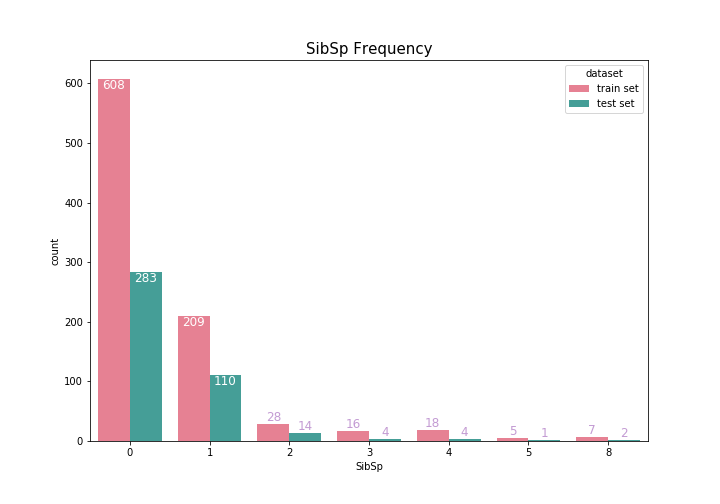

# graphs

---

## Draw bar graphs

#### Pclass bar graph of Train data and Test data

 

#### Pclass bar graph of Train data per Deceased or Survived

 

#### Sex bar graph of Train data and Test data

 

#### Sex bar graph of Train data per Deceased or Survived

 

#### Embarked bar graph of Train data and Test data

 

#### Embarked bar graph of Train data per Deceased or Survived

 

#### SibSp bar graph of Train data and Test data

 

#### SibSp bar graph of Train data per Deceased or Survived

 

#### Parch bar graph of Train data and Test data

 

#### Parch bar graph of Train data per Deceased or Survived

